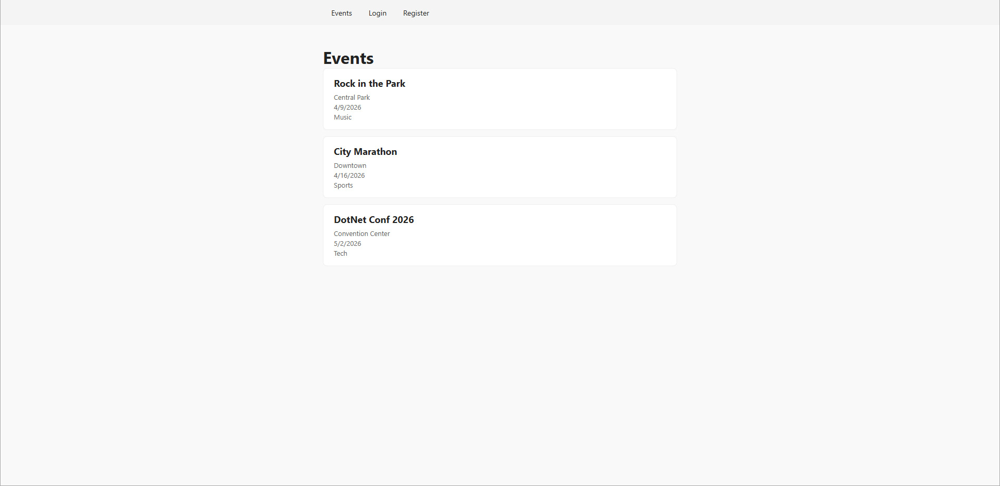
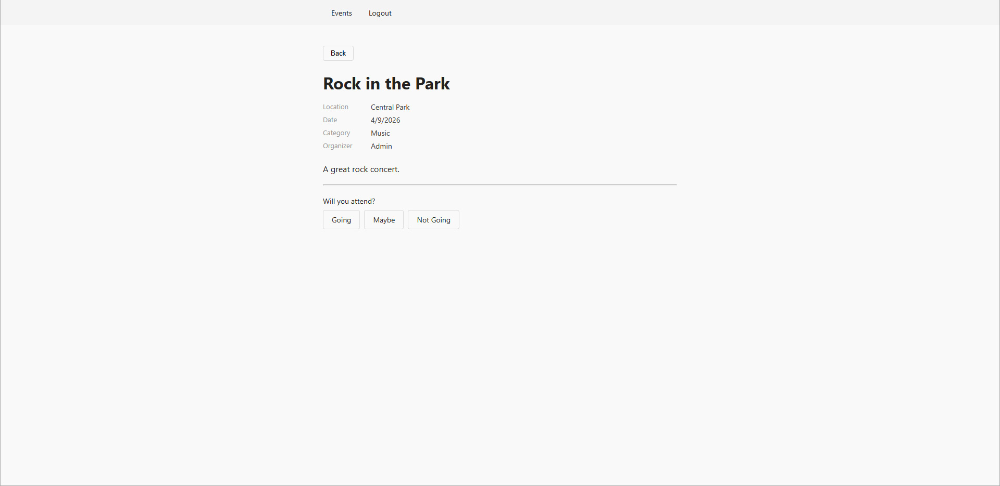
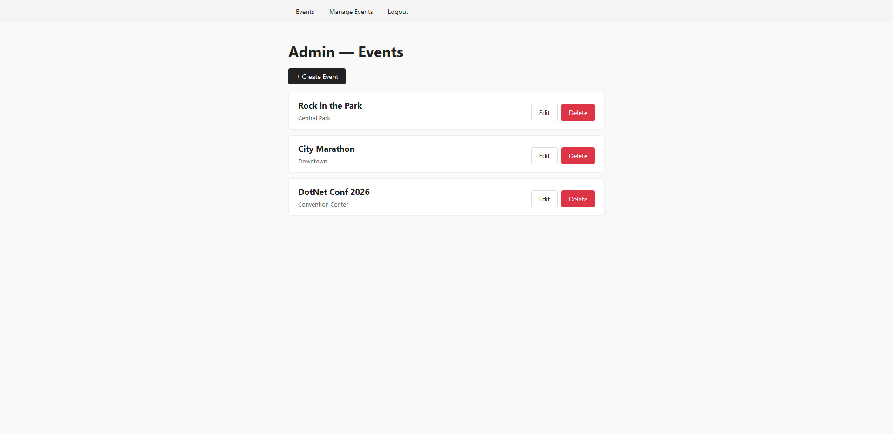

# Event Planner

A fullstack event management app built with ASP.NET Core Web API and React. Public users can browse events; registered users can RSVP; admins can manage events.


*Events list - public, no login required*


*Event detail - authenticated user with RSVP options*


*Admin panel - create, edit, and delete events*

---

## Prerequisites

- [.NET 8 SDK](https://dotnet.microsoft.com/download)
- [Node.js 20+](https://nodejs.org/)
- SQL Server Express (default instance `.\SQLEXPRESS`)

---

## Clone & install

```bash
git clone <repo-url>
cd event-planner
```

Install API dependencies:
```bash
cd api/EventPlanner.Api
dotnet restore
```

Install client dependencies:
```bash
cd client
npm install
```

---

## Database setup

Apply migrations (from `api/EventPlanner.Api/`):
```bash
dotnet ef database update
```

Seed data runs automatically on first startup - no extra steps needed.

The connection string is in `api/EventPlanner.Api/appsettings.Development.json` and targets `.\SQLEXPRESS` by default. No changes needed for a standard SQL Server Express install.

---

## Running the app

Start the API (from `api/EventPlanner.Api/`):
```bash
dotnet run
```

Start the client (from `client/`):
```bash
npm run dev
```

The client runs at `http://localhost:5173`. The API port is printed on startup. If it differs from `7263`, update the proxy target in `client/vite.config.js` to match.

---

## Running tests

Backend (from `api/`):
```bash
dotnet test
```

Frontend (from `client/`):
```bash
npm run test
```

---

## Team

**Lana**
- Project planning: defined the architecture, broke work into issues, and coordinated the team's sprint progress
- Configured CORS
- Implemented Event CRUD endpoints + EventService
- Implemented RSVP endpoints + RsvpService

**William**
- Created ASP.NET Core Web API project
- Wrote seed data
- Set up React Router with basic routes
- Wrote backend unit tests: RsvpService
- Wrote frontend component tests

**Olof**
- Defined data models
- Set up ASP.NET Core Identity
- Created nav/layout component
- Built RSVP UI on event detail page
- Wrote backend unit tests: EventService

**Oleksandr**
- Configured SQL Server Express + EF Core
- Added global error handling middleware
- Implemented JWT generation with role claims
- Implemented register + login endpoints
- Scaffolded React app with Vite
- Built Login and Register forms
- Created AuthContext
- Implemented protected route wrapper
- Set up Axios interceptor for Authorization header
- Built events list page and event detail page
- Built admin event management UI
- Implemented role-based UI

---

## Architecture overview

The backend is an ASP.NET Core Web API using EF Core Code-First with SQL Server Express and JWT-based auth via ASP.NET Core Identity. The frontend is a React + Vite SPA that communicates with the API via Axios. The repo is a monorepo with `api/` for the backend and `client/` for the frontend.
